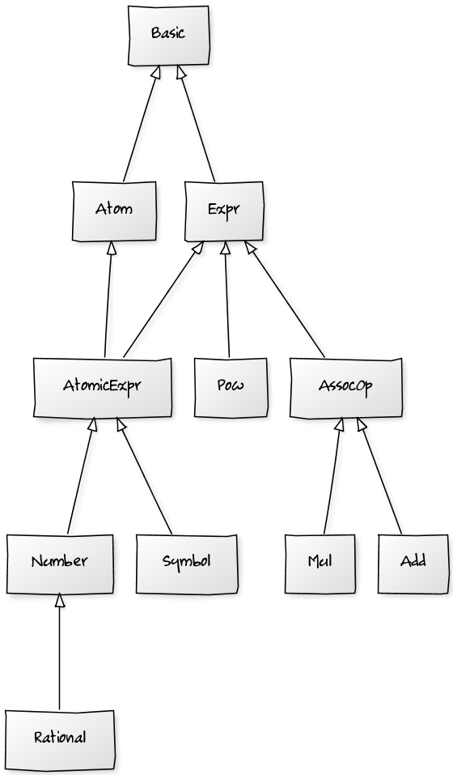

# UD Core Docs

## Overview

Basic class diagram of core:

<!--
Picture created with the help of we-service

http://yuml.me

Code:

[Basic]^-[Expr]
[Expr]^-[AssocOp]
[AssocOp]^-[Add]
[AssocOp]^-[Mul]
[Expr]^-[Pow]
[Basic]^-[Atom]
[Atom]^-[AtomicExpr]
[Expr]^-[AtomicExpr]
[AtomicExpr]^-[Number]
[AtomicExpr]^-[Symbol]
[Number]^-[Rational]
-->